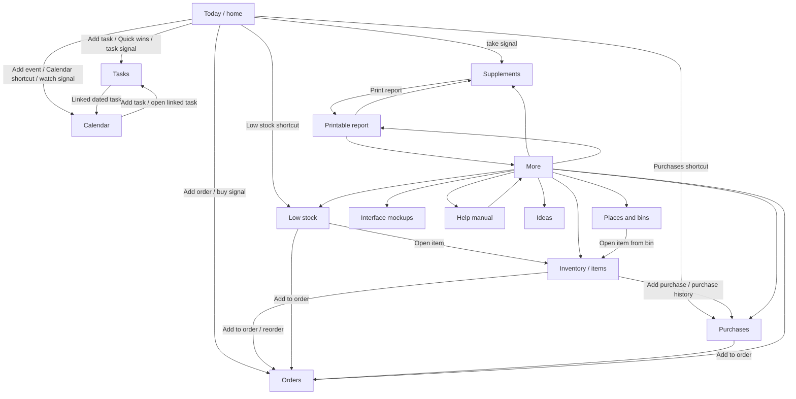

# Mom Home App Map

This document maps the current Mom Home app structure in plain language: what is
on each page, which buttons appear there, and where each action leads. It is a
builder-facing design and QA aid, not a new user-facing feature.

## Scope

- Map the existing local-first MVP screens and flows.
- Keep visual design decisions separate from navigation structure.
- Use this before changing page layouts so every button has a known destination.
- Treat future cloud, AI, vault, and large dependency-map ideas as later layers.

## Global Navigation

The bottom navigation appears everywhere except the printable report view.

| Button | Opens view | Purpose |
| --- | --- | --- |
| Today | `home` | Daily front door with signals, quick actions, focus options, and shortcuts. |
| Tasks | `tasks` | Task list, filters, task form, projects, flags, tags, and star controls. |
| Calendar | `calendar` | Month grid, selected-day agenda, dated tasks, events, reminders, and recurrence. |
| Inventory | `items` | Household item list, add-item flow, search, and item detail/history. |
| Ideas | `ideas` | Visual planning boards for saved ideas, rooms, projects, and future purchases. |
| More | `more` | Settings, help, cloud protection, exports, backup restore, and secondary areas. |

Secondary pages are reached from page buttons rather than the bottom navigation:
`low`, `places`, `orders`, `purchases`, `supplements`, `mockups`, `help`, and `report`.

## Visual Navigation Sketch

This diagram is intentionally simple. It shows page movement, not visual layout.

For click-by-click verification, see [Navigation QA Checklist](./navigation-qa-checklist.md).

## Page Map

### Today (`home`)

**Purpose:** Calm daily landing page.

**Shows:**

- Date and Today heading.
- Today lens interface.
- Focus controls.
- Focus Season timer.
- Optional energy journal form.
- Footer shortcuts with live counts.

**Buttons and destinations:**

| Button/action | Destination or result |
| --- | --- |
| Add task | Opens task form and switches to `tasks`. |
| Add event | Opens calendar event form and switches to `calendar`. |
| Add order | Opens order form and switches to `orders`. |
| Log energy | Shows the energy journal form on Today. |
| Today signal: task/do/help | Opens `tasks`, with help signals filtered when appropriate. |
| Today signal: buy | Opens `orders`. |
| Today signal: take | Opens `supplements`. |
| Today signal: watch/calendar | Opens `calendar`. |
| Quick wins | Opens `tasks` filtered to quick wins. |
| Calendar | Opens `calendar`. |
| Low stock | Opens `low`. |
| Purchases | Opens `purchases`. |
| Calm | Opens `calm`. |

### Interface mockups (`mockups`)

**Purpose:** Preview a few temporary graphical placeholder directions without
replacing the working Today screen or changing the household data engine. The screen can be opened from More or directly from the deployed app with `#mockups` in the URL, such as `https://alekpeed.github.io/momos/#mockups`.

**Shows:**

- Hearth, Quiet command, and Glass dashboard concept cards.
- Live counts from the current household data.
- Buttons that route to existing Tasks, Orders, Supplements, Calendar, Low
  stock, Help requests, Inventory, Ideas, Purchases, and Calm screens.

**Buttons and destinations:**

| Button/action | Destination or result |
| --- | --- |
| Back to More | Opens `more`. |
| Hearth: Quick wins | Opens `tasks` filtered to quick wins. |
| Hearth: Buy list | Opens `orders`. |
| Hearth: Supplements | Opens `supplements`. |
| Quiet command rows | Open the matching Tasks, Calendar, Low stock, or Help requests screen. |
| Glass dashboard pills | Open Inventory, Ideas, Purchases, or Calm. |

### Calm (`calm`)

**Purpose:** Give Mom a quiet reset screen with optional local sound and quick access back to the focus timer, quick wins, help, or energy logging.

**Shows:**

- Breathing/reset visual.
- Selected calm sound control.
- Play sound and silent-mode actions.
- Focus timer preset shortcuts.
- Quick wins, energy log, and help shortcuts.

**Buttons and destinations:**

| Button/action | Destination or result |
| --- | --- |
| Back to Today | Opens `home`. |
| Play sound | Plays the selected local sound if the browser allows audio. |
| Use silent | Sets the calm/focus completion sound to silent. |
| Timer preset | Updates Focus Season duration and keeps timer stopped. |
| Open Focus Season | Opens `home`. |
| Show quick wins | Opens `tasks` filtered to quick wins. |
| Log energy | Shows the energy journal form on Calm. |
| Open help | Opens `help`. |

### Tasks (`tasks`)

**Purpose:** Track work, project grouping, prerequisites, helper needs, custom
flags/tags, and stars.

**Shows:**

- Add task button.
- Optional task form.
- Task filters: Open, Next up, Today, Starred, Quick wins, Help, All.
- Task cards.
- Project map/list.
- Custom flags and tags panel.

**Buttons and destinations:**

| Button/action | Destination or result |
| --- | --- |
| Add | Opens task form on `tasks`. |
| Filter chips | Stay on `tasks` and change task list scope. |
| Task card: Edit | Opens task form for that task. |
| Task card: Done | Marks task Done. |
| Task card: Waiting | Marks task Waiting. |
| Task card: Delete | Confirms and deletes the task. |
| Project map task: Open task | Opens task form for that task. |
| Show/Hide finished | Toggles finished project tasks. |
| Add project | Opens project form. |
| Project card: Add task | Opens task form with project preselected. |
| Project card: Edit | Opens project form. |
| Project card: Delete | Confirms project removal; tasks stay unassigned. |
| Add flag | Opens custom flag form. |
| Add tag | Opens custom tag form. |
| Flag/tag Edit | Opens the matching flag/tag form. |
| Flag/tag Delete | Removes the custom flag/tag and unassigns it from tasks. |

### Calendar (`calendar`)

**Purpose:** See dated events, dated tasks, recurrence, reminders, and open-app
nag behavior.

**Shows:**

- Add event and Add task buttons.
- Device-alert status.
- Optional calendar form.
- Month grid with selected date.
- Selected-day agenda.
- Coming-up list for the next sixty days.

**Buttons and destinations:**

| Button/action | Destination or result |
| --- | --- |
| Add event | Opens calendar form on `calendar`. |
| Add task | Opens task form and switches to `tasks`. |
| Previous / Next | Changes calendar month. |
| Today | Selects today's date and current month. |
| Day cell | Selects that date. |
| Selected-day Add | Opens calendar form for selected day. |
| Calendar card: Edit | Opens calendar form for that event. |
| Calendar card: Open task | Opens linked task form and switches to `tasks`. |
| Calendar card: Delete | Confirms and deletes the event. |
| Dated task: Open | Opens task form and switches to `tasks`. |
| Coming-up row | Selects that date in the calendar. |

### Inventory (`items`)

**Purpose:** Store household item records, photos, locations, condition, quantity,
preferred store, purchase history, and reorder entry points.

**Shows:**

- Inventory search/filter area.
- Add item form when opened.
- Item cards.
- Item detail panel for selected item.
- Purchase history and active order status for an item.

**Buttons and destinations:**

| Button/action | Destination or result |
| --- | --- |
| Add item / plus action | Opens item form on `items`. |
| Item card: Add to order | Opens order form and switches to `orders`. |
| Item card: Mark plenty / Mark out | Updates quantity status. |
| Item card: Open item | Selects item detail on `items`. |
| Item detail: Add purchase | Opens purchase form context for that item. |
| Item detail: Reorder / Add to order | Opens order form and switches to `orders`. |
| Item detail: Product link | Opens saved product URL when present. |
| Item detail: Copy link | Copies saved product URL when present. |
| Item detail: Edit | Opens item form. |
| Item detail: Delete | Confirms deletion and removes related item links. |

### Ideas (`ideas`)

**Purpose**

Runs the Visual Planner: boards, sections, idea cards, source memory, comparisons, export/print, and conversion into tasks, orders, inventory, projects, or reminders.

**Shows**

- Active board count, saved card count, archived count, and board estimate.
- Add/edit board, section, and card forms.
- Active board list with room, section count, card count, notes, open, edit, and archive actions.
- Board detail with filters, sorting, section strip, favorite comparison, budget summary, cards, archive/trash, export, and print.
- Card actions for edit, favorite, archive, delete/restore, copy to another board, open source, and conversion into other Mom Home records.

**Buttons and destinations**

| Button/action | Result |
| --- | --- |
| Add board | Opens the board form on Ideas. |
| Add section | Opens the board-section form for the selected board. |
| Add card | Opens the idea-card form for the selected board. |
| Save board/card/section | Adds or updates local-first Ideas records. |
| Edit | Reopens that board, section, or card in its form. |
| Archive / Delete / Restore | Moves records out of the active view while keeping recovery paths. |
| Copy to another board | Adds a second placement for the same card without duplicating the card. |
| Make task/order/item/project/reminder | Creates the connected Mom Home record and keeps the original idea linked. |
| Export board / Print | Produces a clean board report for sharing or printing. |

**Data used**

- Idea boards.
- Idea board sections.
- Idea board placements.
- Idea cards.
- Locations for optional room/area assignment.

### Low Stock (`low`)

**Purpose:** Focus only on items that need inventory attention.

**Shows:**

- Items marked low, very low, out, or too much.
- Last purchase summary when present.
- Active order count.

**Buttons and destinations:**

| Button/action | Destination or result |
| --- | --- |
| Add to order | Opens order form and switches to `orders`. |
| Open item | Opens selected item detail and switches to `items`. |
| Mark plenty / Mark enough / Mark out | Updates quantity status in place. |
| More/back-style links when present | Return to `more` or related source area. |

### Places and Bins (`places`)

**Purpose:** Manage household locations, containers, bin photos, and QR labels.

**Shows:**

- Location list.
- Container/bin list.
- Location form when opened.
- Container form when opened.
- Selected container detail and QR code.

**Buttons and destinations:**

| Button/action | Destination or result |
| --- | --- |
| Add place/location | Opens location form on `places`. |
| Add bin/container | Opens container form on `places`. |
| Container card/detail | Selects active container detail. |
| Download QR | Downloads or opens the QR label for that bin. |
| Copy scan link | Copies a URL that opens the matching container. |
| Edit place/bin | Opens matching edit form. |
| Delete place/bin | Confirms deletion and removes that place/bin record. |
| Open item from bin list | Opens selected item detail and switches to `items`. |

### Orders (`orders`)

**Purpose:** Track things that need buying, are ordered, were purchased, or were
received.

**Shows:**

- Order form when opened.
- Scope filters: Needed, Ordered, Received, All.
- Order cards with item, vendor, urgency, status, delivery, tracking, and notes.

**Buttons and destinations:**

| Button/action | Destination or result |
| --- | --- |
| Add order | Opens order form on `orders`. |
| Order scope filters | Stay on `orders` and change visible order list. |
| Order card: Edit | Opens order form for that entry. |
| Order card: Mark ordered/purchased/received/cancelled when present | Updates order status. |
| Tracking/product links when present | Opens saved external URL. |
| Linked item action when present | Opens item detail and switches to `items`. |
| Back to More when present | Opens `more`. |

### Purchases (`purchases`)

**Purpose:** Remember what was bought, where it came from, and whether to reorder,
compare, substitute, or avoid.

**Shows:**

- Purchase dashboard counts.
- Purchase filters.
- Purchase cards.
- Purchase form when opened.

**Buttons and destinations:**

| Button/action | Destination or result |
| --- | --- |
| Add purchase from an inventory item | Opens purchase form for that item. |
| Purchase filters | Stay on `purchases` and filter records. |
| Purchase card: Add to order | Opens order form and switches to `orders`. |
| Purchase card: Edit | Opens purchase form. |
| Product/receipt links when present | Opens saved external URL. |
| Delete | Confirms and removes purchase record. |
| Back to More when present | Opens `more`. |

### Supplements (`supplements`)

**Purpose:** Track supplement bottles, remaining counts, reorder thresholds, and
taken logs. This page does not provide medical advice.

**Shows:**

- Supplement dashboard counts.
- Low supplement warning when present.
- Supplement cards.
- Supplement form and log form when opened.
- PDF/print/CSV report actions.

**Buttons and destinations:**

| Button/action | Destination or result |
| --- | --- |
| Add supplement | Opens supplement form on `supplements`. |
| Log 1 taken / Log amount | Adds supplement log and may reduce remaining count. |
| Edit supplement | Opens supplement form. |
| Delete supplement | Confirms and removes supplement and logs. |
| Download PDF | Downloads supplement PDF report. |
| Print report | Opens `report` scoped to supplements and launches print. |
| Export CSV | Downloads supplement CSV. |
| Back to More when present | Opens `more`. |

### More (`more`)

**Purpose:** House settings, cloud protection, reports, exports, backup restore,
manual/help, and secondary navigation.

**Shows:**

- Help/manual entry.
- Cloud settings/protection with provider configuration status, online/offline state, backup/restore, queued backup retry, and shared access controls.
- App settings such as Today lens and star mode.
- Assistant handoff text actions.
- Report/export actions.
- Backup restore review.
- Quick links to secondary areas.

**Buttons and destinations:**

| Button/action | Destination or result |
| --- | --- |
| Open manual | Opens `help`. |
| Cloud protection actions | Stay in More and use cloud account, backup, restore, queued retry, and sharing controls. |
| Default Today lens select | Updates default Today lens setting. |
| Star mode select | Updates star display setting. |
| Copy assistant docket | Copies handoff text. |
| Download assistant docket | Downloads handoff text. |
| Printable report | Opens `report`. |
| Download JSON backup | Downloads full local JSON backup. |
| Export item/order/purchase/task/supplement CSV | Downloads matching CSV file. |
| Choose backup file | Previews JSON backup without restoring. |
| Download current data first | Downloads current JSON before restore. |
| Restore this backup | Confirms and replaces current browser data. |
| Cancel backup review | Clears backup preview. |
| To-order | Opens `orders`. |
| Places and bins | Opens `places`. |
| Purchases | Opens `purchases`. |
| Calm | Opens `calm`. |
| Interface mockups | Opens `mockups`. |
| Low stock | Opens `low`. |
| Inventory | Opens `items`. |
| Supplements | Opens `supplements`. |

### Help (`help`)

**Purpose:** In-app manual and beginner guidance.

**Shows:**

- Help topics for Today, Tasks, Calendar, Inventory, Purchases, Supplements,
  Cloud, Export/Restore, and iPhone install.

**Buttons and destinations:**

| Button/action | Destination or result |
| --- | --- |
| Back | Opens `more`. |

### Report (`report`)

**Purpose:** Printable household or supplement report.

**Shows:**

- Summary counts.
- Starred/today/quick/help task sections.
- Calendar coming-up section.
- Orders and arrivals.
- Low-stock and purchase sections.
- Supplement section when included.

**Buttons and destinations:**

| Button/action | Destination or result |
| --- | --- |
| Back to More | Opens `more`. |
| Back to supplements | Opens `supplements` when report is supplement-scoped. |
| Download PDF / print actions where present | Downloads or opens browser print flow. |

## Primary User Flows

### Add something to do

Today → Add task → Tasks form → Save task → Tasks list.

Calendar → Add task → Tasks form → Save task → Tasks list.

### Add an event

Today → Add event → Calendar form → Save event → Calendar selected day.

Calendar → Add event → Calendar form → Save event → Calendar selected day.

### Add something to buy from low stock

Low stock → Add to order → Orders form → Save order → Orders list.

Inventory item → Add to order → Orders form → Save order → Orders list.

Purchase card → Add to order → Orders form → Save order → Orders list.

### Find where something lives

Inventory → Open item → Read location/bin → optionally open Places and bins from
More → select container/bin → review contents and QR label.

### Make or use a bin QR label

More → Places and bins → Add/edit bin → container detail → Download QR or Copy
scan link → scanned link opens the matching bin when the app loads.

### Preserve data before major changes

More → Download JSON backup → optionally export CSVs → choose restore file only
when needed → review restore counts/warnings → Download current data first →
Restore this backup.

### Produce a helper handoff

More → Copy assistant docket or Download assistant docket → share outside the app.

### Print a household report

More → Printable report → Report view → browser print or save flow.

### Use the Calm screen

Today → Calm or Focus Season → Calm screen → play selected sound, log energy, show quick wins, or return to Today.

### Print supplement information

Supplements → Print report → Report view scoped to supplements → browser print or
save flow.

## Open Design Questions

- Which secondary pages should stay behind More, and which deserve bottom-nav
  access later?
- Should Inventory and Places/Bins stay separate, or should bins become a subtab
  inside Inventory?
- Which actions should be one-tap from Today versus tucked into their home page?
- Which export/backup actions need stronger warnings or simpler wording?
- Should task project/dependency mapping remain a builder/design artifact until a
  user-facing version is clearly specified?

## Future Map Layers

After this page map is stable, future docs can add:

- A Phase 2 navigation simplification proposal.
- A user-facing task/project map design brief, if still wanted later.

## Alerts / Help Requests

- Entry points: Today `Ask help`, Today footer `Help`, More → Household areas → Help requests.
- Stores helper contacts locally with name, phone, email, relationship, and preferred marker.
- Stores help requests with title, details, urgency, status, helper, related task, and related order.
- Provides copy, SMS draft, and email draft actions.
- Includes non-911 urgent helper alert language and acknowledgement.
- Includes delivery watch for ordered/purchased entries with expected delivery dates.
- Shows notification permission status and default repeat reminder interval.

## Phase 5 Purchase Intelligence

- Entry point: Purchases.
- `Import text` opens a review-first receipt/email text queue.
- Purchase records can store receipt links, receipt screenshots/photos, receipt text, local AI-style summaries, confidence, checked-at timestamps, and replacement options.
- `Refresh local matches` builds replacement/substitute candidates from saved item replacement links and prior purchase records.
- No remote AI, live inbox, scraping, or retailer API is called by the local implementation.

## Phase 6 Private Vault

- Entry point: More → Private vault.
- Vault records are client-side encrypted with passphrase-derived AES-GCM keys.
- Visible metadata is limited to title, category, hint, timestamps, and encryption parameters.
- Plaintext is revealed only after passphrase unlock on the Vault screen.
- Vault plaintext is excluded from helper handoff, AI-style summaries, and normal reports.
